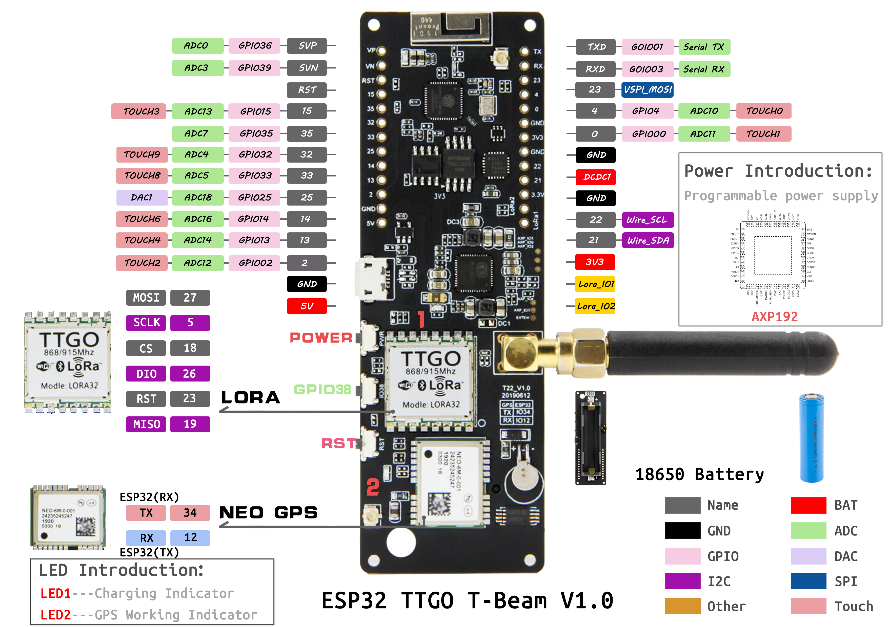

<h1 align = "center">🌟ESP LoRa TTGO T-Beam V1.1 in Otputs Control using BLuetooth and LoRa🌟</h1>

## **English**

## USE Arduino IDE

1. Install the current upstream Arduino IDE at the 1.8 level or later. The current version is at the [Arduino website](http://www.arduino.cc/en/main/software). (NOTE: MacOS may require that you install separate drivers to interact with your board. You will get error messages that occur when the IDE attempts to upload code. You should consider running the Arduino IDE in a Virtual Machine on Linux. Installing other drivers on your Mac is out of scope for this document.)
2. Start Arduino and open Preferences window. In additional board manager add url: `https://raw.githubusercontent.com/espressif/arduino-esp32/gh-pages/package_esp32_index.json` If you have multiple URLs (e.g., for other boards), just add previously mentioned URL, separated by a comma.
3. Copy all folders in the `lib` directory to your Arduino Libraries Directory,
- in MacOS, it is `~/Documents/Arduino/libraries`
- in Linux, it is `~/Arduino/libraries` 
- in Windows, it is `Documents/Arduino/libraries` 
4. Open the corresponding example
5. In the Arduino Application, navigate to the Board Manager menu ("Tools => Menage Libraries "), search for `LoRa`, and make sure that you install the latest version. After you do this, navigate to the Board Manager menu ("Tools => Board => Board Manager"), search for `esp32`, and make sure that you install the latest version. You can select the board you have from the list of boards in the "ESP32 Arduino" menu ("Tools=> Board => ESP32 Arduino"). It's very important to note that the list of boards is NOT in alphabetical order. Look for the board you are working with carefully in the list. 
6. `T-Beam` users can choose `TTGO T-Beam`
7. Select the port of the board in the port
8.  Upload


## Product 📷

| Product                                   | Product Link            | Schematic                                         | Corresponding example macro definition   |
| :---------------------------------------: | :----------------------:| :-----------------------------------------------:| :--------------------------------------:|
| [T-Beam SX1278/76][1-4]                   | [AliExpress][1]         | [TBeamV0.7][1-1] / [TBeamV1.0][1-2] / [TBeamV1.1][1-3] | LILYGO_TBeam_V0_7 / LILYGO_TBeam_V1_X   |
| [T-Beam SX1262][1-4]                      | [AliExpress][2]         | [TBeamV0.7][1-1] / [TBeamV1.0][1-2] / [TBeamV1.1][1-3] | LILYGO_TBeam_V0_7 / LILYGO_TBeam_V1_X   |


[Link do T-Beam ](https://pt.aliexpress.com/item/32967228739.html)



[Link do T-Beam SX1262](https://pt.aliexpress.com/item/4001287221970.html)


[1]: https://pt.aliexpress.com/item/32967228739.html "T-Beam SX1278/76"
[1-1]: !(file:ESP%20LoRa%20%2B%20Bluetooth%20control%20Outputs/TBeam.jpg)
[1-2]: !(file:ESP%20LoRa%20%2B%20Bluetooth%20control%20Outputs/TBeam.jpg)
[1-3]: !(file:ESP%20LoRa%20%2B%20Bluetooth%20control%20Outputs/TBeam.jpg)
[1-4]: !(file:ESP%20LoRa%20%2B%20Bluetooth%20control%20Outputs/TBeam.jpg)
[2]: https://pt.aliexpress.com/item/4001287221970.html "T-Beam SX1262"


## Example description

The project is using 2 ESP 32 LoRa TTGO T-Beam v1.1 boards and a phone app. The phone sends commands via the app via Bluetooth protocol to one of the boards, which then transmits these commands further via LoRa protocol, which allows for increased signal reception range.
Created an application using MIT App Inventor for android, it has an inferface with 4 buttons for control, to do this you must first connect via BT on the phone and then in the application by clicking on the Bluetooth icon placed, we will then get a list of devices that are seen without BT, you must select our board, when properly connected will inform the message "connected" .  The app is also included in the project. 

```
├─ArduinoLoRa       
│  ├─LoRaReceiver
│  └─LoRaSenderBt
```

## Radio resolution

How to distinguish the model of Radio just need to look at the sticker on the board, 
433MHz is SX1278,
868MHz is SX1276,
If the label says SX1262 then it is SX1262


## PinOut

- See [utilities.h](examples/ArduinoLoRa/LoRaReceiver/utilities.h)


